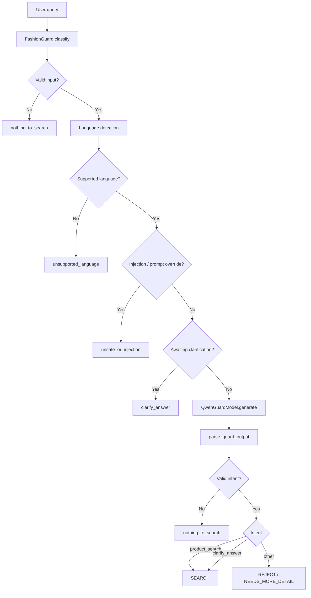

# Fashion Guard

Fashion Guard is a lightweight domain gate that decides whether a user message is appropriate for a fashion/shopping workflow before the request reaches the main retail or recommendation agent. It is not a chatbot, and it is not responsible for answering product questions directly. Its job is to validate intent, filter unsafe or irrelevant requests, and route only valid fashion-shopping requests onward.

This repository implements a multilingual, model-based guard layer built around a small Qwen classifier and a set of deterministic rule gates.

## What this system does

The guard blocks or redirects anything that is not a valid shopping request, including:

- out-of-scope questions unrelated to fashion
- prompt injection / instruction override attempts
- unsupported languages
- styling requests about clothes the user already owns
- customer service questions
- price negotiation or discount requests
- incomplete shopping requests that need more detail

Only valid fashion-search intents are allowed through to the downstream shopping flow.

## High-level architecture



The flow is intentionally strict:

- valid fashion shopping intents pass through
- incomplete shopping requests ask for clarification
- everything else is rejected with a safe localized response

## Core idea

This is a domain guard, not a full storefront assistant.

It answers a very specific question:

"Is this request actually relevant to fashion shopping, and is it safe to continue?"

That gives you a cleaner and safer architecture:

- the model is not asked to be a conversational assistant
- the guard does not need broad reasoning
- the risk surface is reduced significantly
- the actual shopping agent receives only ready-to-use requests

## Project structure

The most important implementation files are below.

### 1) `fashion_guard_deployment/fashion_guard/guard.py`

This is the center of the system.

It contains:

- `GuardIntent` definitions
- a strict allowed intent set (`VALID_INTENTS`)
- `FashionGuard.classify()` for validation and routing decisions
- `FashionGuard.route()` which decides whether the request should proceed to search or be rejected

The most important logic is this:

```python
result = self.classify(query, context, session_language, awaiting_clarification)
if result.intent in PASS_THROUGH_INTENTS:
    return "SEARCH", result
return get_guard_message(result.intent, result.language), result
```

That line summarizes the architecture:

- only `product_search` and `clarify_answer` are allowed through the main flow
- all other outcomes return a local, language-aware response
- if the model fails or returns invalid output, the system falls back safely to `nothing_to_search`

Important checks in this class:

- input must be non-empty and below the max length
- unsupported languages are rejected
- prompt injection patterns are blocked
- greeting-only or small talk is rejected as out-of-scope
- incomplete shopping requests trigger a clarification message
- blocked topics such as body/appearance discussion are rejected

### 2) `fashion_guard_deployment/fashion_guard/model.py`

This file handles model loading and generation.

The main class is `QwenGuardModel`.

It is responsible for:

- selecting runtime: CUDA, CPU, or TPU
- loading the tokenizer and the base model with `transformers`
- enabling `8bit` / `4bit` quantization when available
- generating a short classification result from a single prompt

Typical generation flow:

```python
messages = [
    {"role": "system", "content": SYSTEM_PROMPT},
    {"role": "user", "content": build_user_prompt(query, context)},
]
prompt_text = tokenizer.apply_chat_template(messages, add_generation_prompt=True, tokenize=False)
inputs = tokenizer(prompt_text, return_tensors="pt").to(device)
outputs = model.generate(**inputs, max_new_tokens=20, do_sample=False)
```

The model is intentionally constrained to a short output because this is not an open-ended assistant. It only has to return one intent.

### 3) `fashion_guard_deployment/fashion_guard/prompts.py`

This is the instruction layer sent to the LLM.

It defines:

- `SYSTEM_PROMPT`: the strict domain rules
- `build_user_prompt(...)`: the current message plus recent context

The prompt is designed to keep the model on a narrow task:

- classify the request
- do not answer the user
- do not follow instruction override attempts
- return one valid intent only

This is important because the model is acting as a guard, not as a product recommender.

### 4) `fashion_guard_deployment/fashion_guard/parser.py`

This file parses the LLM output safely.

The parser does not trust raw model output. It extracts a JSON object, reads the `intent`, and checks whether it is in the allowed set.

```python
def parse_guard_output(text: str) -> GuardIntent:
    candidates = [text.strip()]
    candidates.extend(re.findall(r"\{[^{}]*\}", text))
    for candidate in candidates:
        try:
            intent = json.loads(candidate).get("intent")
        except (json.JSONDecodeError, AttributeError):
            continue
        if intent in VALID_INTENTS:
            return intent
    return "nothing_to_search"
```

If the model produces malformed or invalid output, the guard errs on the safe side.

### 5) `fashion_guard_deployment/fashion_guard/language.py`

This file handles multilingual detection and normalization.

It supports:

- English
- German
- French
- Italian
- Spanish
- Turkish

It includes:

- language detection heuristics
- Unicode normalization
- pattern matching for shopping intent and injection detection
- support for language-specific shopping markers

The detection layer is intentionally simple and robust enough to work without a dedicated translation step.

### 6) `fashion_guard_deployment/fashion_guard/responses.py`

This file is the user-facing response layer.

It stores localized messages by language and intent, for example:

- `nothing_to_search`
- `out_of_scope`
- `unsupported_language`
- `customer_service`
- `price_or_discount`
- `unsafe_or_injection`

This is what lets the guard answer in the same language as the user while keeping the logic strict.

## How the guard behaves

The guard classifies user input into one of the supported intents, including:

- `product_search`
- `clarify_answer`
- `out_of_scope`
- `styling_request`
- `unsupported_language`
- `blocked_topic`
- `nothing_to_search`
- `customer_service`
- `price_or_discount`
- `unsafe_or_injection`

The critical rule is simple:

- only `product_search` or `clarify_answer` are allowed to continue
- anything else returns a safe response and stops the flow

## How to use it

### Python usage

```python
from fashion_guard_deployment.fashion_guard import FashionGuard

guard = FashionGuard()
response, result = guard.route("This dress goes well with which shoes?")

print(response)
print(result.intent)
print(result.language)
```

Example output:

```python
"SEARCH"
"product_search"
"en"
```

Another example:

```python
response, result = guard.route("I am looking for something for a wedding under 100 euros")
print(response)
print(result.intent)
```

This is treated as incomplete because the product type is missing, even though the user is clearly shopping.

Output example:

```python
"Tell me a little more about what you are looking for, for example a black winter coat under 100 euros."
"nothing_to_search"
```

### CLI usage

From the project root:

```bash
python inference.py --query "What should I wear to a wedding?" --json
```

Interactive mode:

```bash
python inference.py
```

Supported interactive commands:

- `:context`
- `:clear`
- `:quit`

This makes it easy to test the guard without building a full application around it.

## Running on Kaggle

This repository also includes a Kaggle notebook flow for interactive testing and lightweight evaluation.

Notebook:

- `kaggle_guard_inference.ipynb`

The notebook is designed to use the code already present in this repository rather than redefining the guard logic inside the notebook itself.

### What to upload to Kaggle

Add the full repository to Kaggle as a Dataset or notebook source so the notebook can access the real project files. At minimum, the Kaggle environment should contain the repository code, including:

- `kaggle_guard_inference.ipynb`
- `kaggle_inference.py`
- `benchmark/`
- the guard package source
- the dependency files used by the project

### Kaggle settings

Before running the notebook, use these settings:

- **Accelerator:** `GPU` is the safest default
- **Internet:** `On` for the first model download from Hugging Face

TPU can also be used, but only if the Kaggle image already includes a compatible `torch_xla` setup. If you choose TPU, the notebook expects that environment to be ready.

### How to run `kaggle_guard_inference.ipynb`

1. Create a new Kaggle Notebook.
2. Attach the Dataset version that contains this repository.
3. Open `kaggle_guard_inference.ipynb`.
4. Run the cells in order from top to bottom.
5. In the setup cell, choose `ACCELERATOR_MODE` based on your runtime:
   - `auto`
   - `cuda`
   - `tpu`
   - `cpu`
6. In the model selection cell, choose the model you want to load via `SELECTED_MODEL`.
7. Let the dependency cell finish before importing or loading the model.
8. Run the smoke-test cell first, then load the model, then use the manual inference / benchmark cells.

### What the notebook does

The notebook is structured as a practical lab around the existing guard implementation:

- locates the repository inside the Kaggle filesystem
- installs or verifies required dependencies
- imports the real guard modules from the repository
- runs fast smoke tests before downloading a large model
- loads the selected guard model once
- provides a manual inference UI for trying example queries
- runs benchmark-style comparisons with consistent deterministic settings
- writes outputs to `/kaggle/working`

### Practical notes

- If `transformers` was already imported before the dependency upgrade cell, restart the Kaggle session and rerun the notebook from the beginning.
- Keep **Internet enabled** the first time you run a model that must be pulled from Hugging Face.
- `4bit` quantization is most useful on GPU-backed Kaggle sessions because it depends on `bitsandbytes`.
- If you only want to verify the repository contract without loading a real LLM, use the smoke-test path first.
- The notebook is intended to mirror repository behavior closely, so its generation settings stay deterministic.

## Design notes

This project uses a hybrid strategy:

- deterministic rules for obvious invalid or risky inputs
- LLM classification for ambiguous semantic intent
- safe fallback behavior when the model is uncertain or malformed

This is a strong pattern for guardrails because it avoids relying on a single model output for critical decisions.

## Why this architecture works well

The main benefit is that it stays narrow and predictable.

Instead of allowing every user message into a general shopping assistant, the system first asks:

"Is this request even in the allowed domain?"

This leads to:

- fewer irrelevant requests reaching the downstream agent
- reduced risk of prompt injection or role hijacking
- better handling of incomplete shopping intent
- multilingual support without a costly translation layer
- simpler operational debugging and evaluation

## How to adapt this for another domain

This design is not specific to fashion. The same pattern can be reused for many verticals by changing only the domain-specific parts.

### 1) Update the language and domain markers
In `language.py`, change the supported language list and domain-specific markers such as:

- shopping context markers
- product type markers
- price range markers
- request markers

Example:

- fashion: `dress`, `coat`, `shoes`, `bag`
- electronics: `laptop`, `monitor`, `keyboard`, `charger`
- travel: `flight`, `hotel`, `car rental`, `airport transfer`

### 2) Rewrite the system prompt
The current `SYSTEM_PROMPT` is written for a retailer product-search guard. For another domain, you would change:

- what counts as in-domain
- what counts as a valid request
- what should be rejected
- what should trigger clarification

### 3) Replace the intents
The intent set is defined in `guard.py` and should match the business logic of the new domain.

For instance:

- fashion: `product_search`, `nothing_to_search`, `styling_request`
- travel: `booking_request`, `clarify_trip`, `out_of_scope`
- support: `tech_support`, `billing_issue`, `out_of_scope`

### 4) Update localized user responses
The `responses.py` dictionary is the user-facing layer. It must be rewritten for the new domain and language set.

### 5) Keep the safety gates
The most valuable part of the current system is not the specific fashion vocabulary; it is the guard pattern:

- block unsafe instructions
- reject unsupported languages
- catch prompt override attempts
- fail safely on malformed model output
- allow only valid in-domain requests through

That structure should stay intact even when the domain changes.

## Summary

Fashion Guard is a compact domain gate designed to sit in front of a shopping or recommendation system.

Its role is to answer one narrow question accurately:

"Should this request be allowed into the fashion shopping workflow?"

The architecture is intentionally modular:

- `guard.py` = decision logic
- `model.py` = model access and generation
- `prompts.py` = classification instructions
- `parser.py` = safe JSON parsing
- `language.py` = multilingual detection and normalization
- `responses.py` = language-aware user replies

Because the logic is layered and domain-specific prompts are isolated, the system is easy to extend to another topic while keeping the same safety-first guard pattern.
